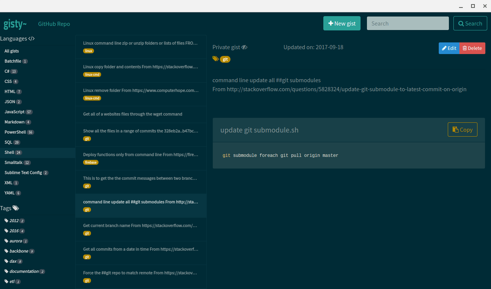

# gisty~
This is a GitHub gist interface, with lots of filters, search, and is not very chatty.

## Work in progress!

Right now only the view, search, filter functions are working, but it's good enough for an initial commit.

To add to the tagging feature use double hash tags and they show up.

The cool thing about this app it the ***all*** of the data is stored in GitHub so you can access all the information of the gist from your favorite integrations.

**Note:** to start using this app you'll need to generate a GitHub API key and enter it the first time at the prompt.  The reason for this is I don't want to run a node server for API authentication.  It saves the key to you local storage so you don't have to keep entering it.

## History / Backstory

With my favorite online gist editor going away and its replacement not syncing to GitHub I figured while waiting for hurricane Irma to pass I'd write up a quick replacement for myself. After writing most of it I thought to  share it for those in similar situations.

You can create one [here](https://github.com/settings/tokens) on your GitHub account.

### Todo

* [ ] Get the editor functions working
* [ ] Multi word search
* [ ] Possibly using local storage / syncing for offline access
* [ ] Make the empty place holders have messages for empty
* [ ] Better setup tutorial
* [ ] Make cool logo

### Thanks

* To the many StackOverflow posts with the tidbits that I needed
* GitHub
* jQuery
* Backbone
* Marionette
* Bootstrap
* highlight.js
* Anyone else that I may have missed